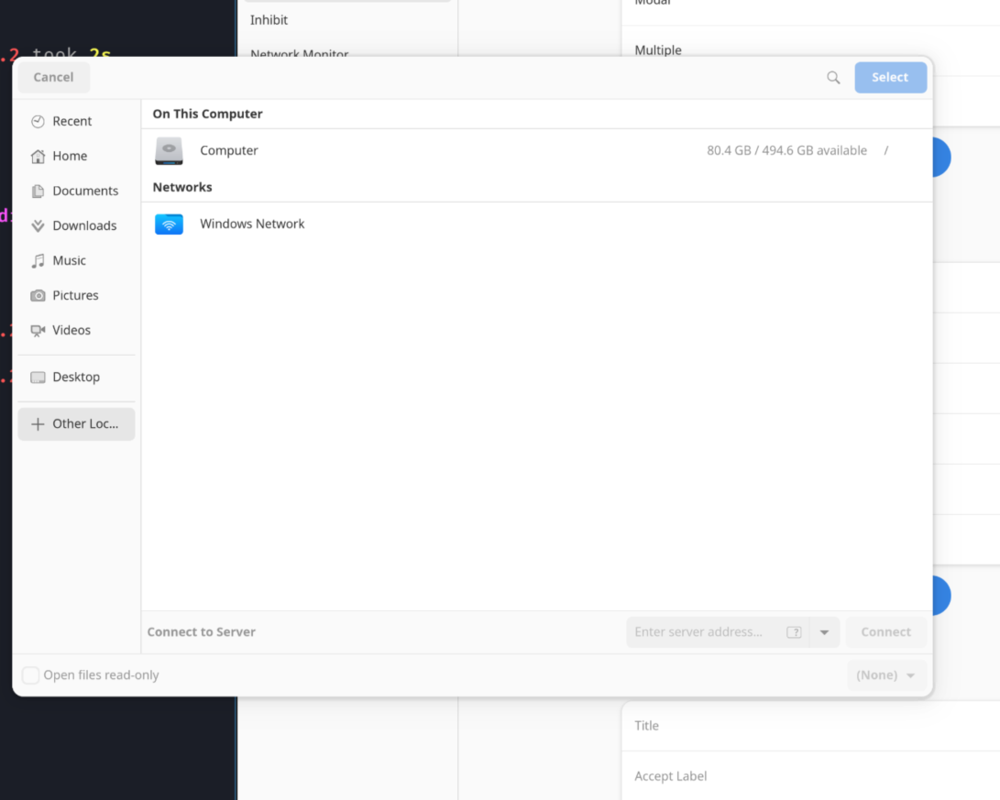
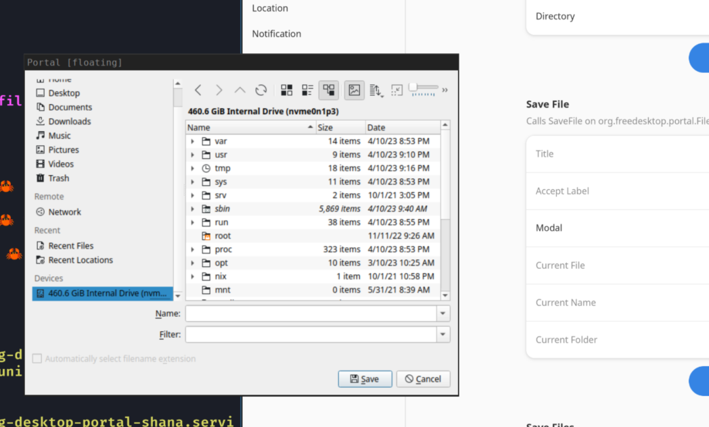

# xdg-desktop-portal-shana

[](https://repology.org/project/xdg-desktop-portal-shana/versions)


## How it works
it just redirect other portal to it, `the portal of portal`, maybe?

now it just use

* Gnome
* Kde
* Gtk
* Lxqt

## How to use

create ~/.config/xdg-desktop-portal-shana/config.toml

write like this

```toml
open_file = "Kde"
save_file = "Gnome"

[tips]
open_file_when_folder = "Lxqt"
```

The keyword you can use include

`Gnome`
`Kde`
`Gtk`
`Lxqt`

or set

```toml
open_file = "org.freedesktop.desktop.impl.lxqt"
save_file = "org.freedesktop.desktop.impl.lxqt"
```

the key now is allowed to set the service path

## Show





## How to use it

to use it, you need to create ~/.config/xdg-desktop-portal/CURRENT_DESKTOP_NAME-portals.conf, for example, if you name is setted as sway, you need to create sway.conf

This will override the config under `/usr/share/xdg-desktop-portal/deskop-portals.conf`, it there is already one.

```
[preferred]
default=luminous
org.freedesktop.impl.portal.Settings=luminous;gtk
org.freedesktop.impl.portal.FileChooser=shana
```
